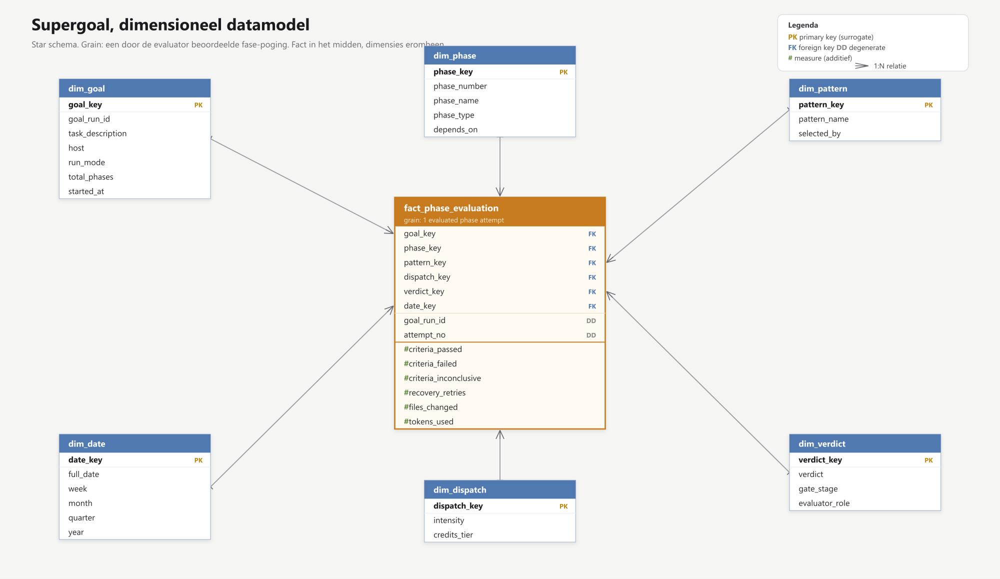

# Supergoal

Plan een grote softwaretaak samen met de agent, laat hem daarna autonoom bouwen, en laat niks "klaar" zijn tot een onafhankelijke controleur het bewijst.

Een skill voor Claude Code en Codex.

<p align="center">
  
</p>
<p align="center"><sub>Schaalbare bron: <a href="docs/architecture.svg">architecture.svg</a> &middot; bewerkbaar: <a href="docs/architecture.drawio">architecture.drawio</a></sub></p>

## Wat het is

Supergoal neemt een taak die je normaal de hele dag moet babysitten en draait hem in twee delen: eerst plan je samen, daarna bouwt de agent zelf. Het verschil met de standaard zit in de controle. De agent die bouwt mag nooit zelf beslissen of het werk klaar is. Dat doet een aparte controleur.

## Waarom dit anders is dan de standaard

De grootste faalmodus van autonome agents is dat ze zichzelf "klaar" verklaren terwijl het niet klopt. Supergoal haalt dat weg:

- **De bouwer keurt nooit zijn eigen werk.** Een onafhankelijke evaluator met een schone context doet elke check zelf opnieuw, blind voor wat de bouwer beweert.
- **Bewijs is empirisch.** De evaluator draait de echte app en kijkt of het gedrag klopt, niet alleen of de tests groen zijn.
- **Gebouwd voor lange runs.** Plan en voortgang staan op schijf en overleven context-verlies. Een regressie rolt terug naar de baseline van de vorige fase. Aan het eind draait een audit tegen het oorspronkelijke plan.
- **Plannen is een gesprek.** In de planfase interviewt de skill je als een architect: een scherpe vraag per keer, met een aanbeveling, plus artikelen en scenario's zodat je op inhoud beslist.
- **Per fase een team.** De generator kan per fase een zwerm specialisten opzetten, elk met een eigen skillset, en ontbrekende skills bijhalen via de skills.sh registry of zelf schrijven. De onafhankelijke evaluator blijft er overheen, dus de bouwkracht groeit zonder dat het vertrouwen daalt. Het schaalt mee met je budget: standaard sequentieel binnen de run, en pas grote parallelle swarms als je account de credits heeft.

## Hoe het werkt

1. **Context.** Memory inladen, kijken welk gereedschap er is (subagents, een manier om de app te draaien), een lopende run hervatten.
2. **Plannen samen.** De skill loopt de beslisboom met je af door te blijven doorvragen, een vraag per keer, met bronnen en scenario's bij de zware keuzes.
3. **Context verzamelen.** Info uit vier bronnen (code, docs, MCP's, skills), met een check of het genoeg is plus een tweede check die juist een gat zoekt.
4. **Plan opdelen.** Zoveel fasen als de taak nodig heeft, elk op zichzelf te controleren, met empirisch bewijs waar gedrag ontstaat.
5. **Plan-review.** Je krijgt een samenvatting plus een losse HTML-pagina met de fasen, de keuzes, de bronnen en de risico's. Jij keurt goed. Dit is de enige stop.
6. **Autonome run.** Een ronde per fase: de generator bouwt, de onafhankelijke evaluator bewijst (ACCEPT of REJECT). REJECT start een herstel van maximaal drie pogingen. Per fase kan de generator een team van specialisten opzetten en ontbrekende skills bijladen (via skills.sh of zelf geschreven); de evaluator blijft er onafhankelijk overheen.
7. **Eindaudit.** Na de laatste fase controleert de evaluator het geheel nog eens tegen het oorspronkelijke plan, voordat de run als klaar geldt.

Twee keer is jouw input nodig: de planfase en de plan-review. Daartussen en erna draait het zelf.

Supergoal kiest zelf de uitvoeringsvorm: `/goal` voor een gewone build, parallelle swarms per fase als je budget het toelaat, of `/loop` (of een scheduled task) als de taak terugkerend is. Niet iedereen heeft een max-account, dus zuinig is de standaard.

## Datamodel

Wil je runs achteraf analyseren, dan past het proces in een dimensioneel model (Kimball star schema). De grain is een door de evaluator beoordeelde fase-poging: elke rij in de fact is een keer dat de generator een fase bouwde en de evaluator er een verdict op gaf.

<p align="center">
  
</p>
<p align="center"><sub>Bewerkbare bron: <a href="docs/star-schema.svg">star-schema.svg</a></sub></p>

De fact `fact_phase_evaluation` houdt de measures bij (criteria pass, fail en inconclusive, retries, gewijzigde bestanden, tokens) en verwijst via surrogate keys naar zes dimensies: `dim_goal`, `dim_phase`, `dim_pattern`, `dim_dispatch`, `dim_verdict` en `dim_date`.

## Installeren

```bash
git clone https://github.com/robinbril/claude-supergoal.git
mkdir -p ~/.claude/skills/supergoal
cp -r claude-supergoal/SKILL.md claude-supergoal/prompts claude-supergoal/references \
      claude-supergoal/scripts claude-supergoal/templates claude-supergoal/docs \
      ~/.claude/skills/supergoal/
```

Voor een project in plaats van globaal: zet dezelfde mappen onder `.claude/skills/supergoal/` in je projectroot.

## Gebruiken

In Claude Code of Codex:

```
/supergoal beschrijf wat je wilt bouwen, fixen of verschepen
```

Daarna: plan samen, keur het plan goed, plak de ene `/goal` regel die de skill voor je klaarzet, en de run draait tot klaar.

## Werkt op

Claude Code en Codex. Waar geen subagents beschikbaar zijn, draait de evaluator als losse stap; de checks die hij overdoet hangen niet van die context af, dus het meeste blijft overeind.

## Wat zit erin

```
SKILL.md                de skill zelf
prompts/                de evaluator, het per-fase team, en de drie context-checks
references/             planning, fase-opdeling, /goal-formaat, repo-vergelijking
scripts/                recon en de working-tree vergelijking
templates/              ROADMAP, STATE, PROTOCOL, fase-spec, review.html
docs/architecture.svg   de procesflow (bewerkbare bron: architecture.drawio)
docs/star-schema.svg    het dimensioneel datamodel (star schema)
```

## Credits

Voortbouwend op het open-source project [supergoal](https://github.com/robzilla1738/supergoal) van Robert Courson (MIT) en op het `/goal`-commando van Claude Code.

## Licentie

MIT. Zie [LICENSE](LICENSE).
