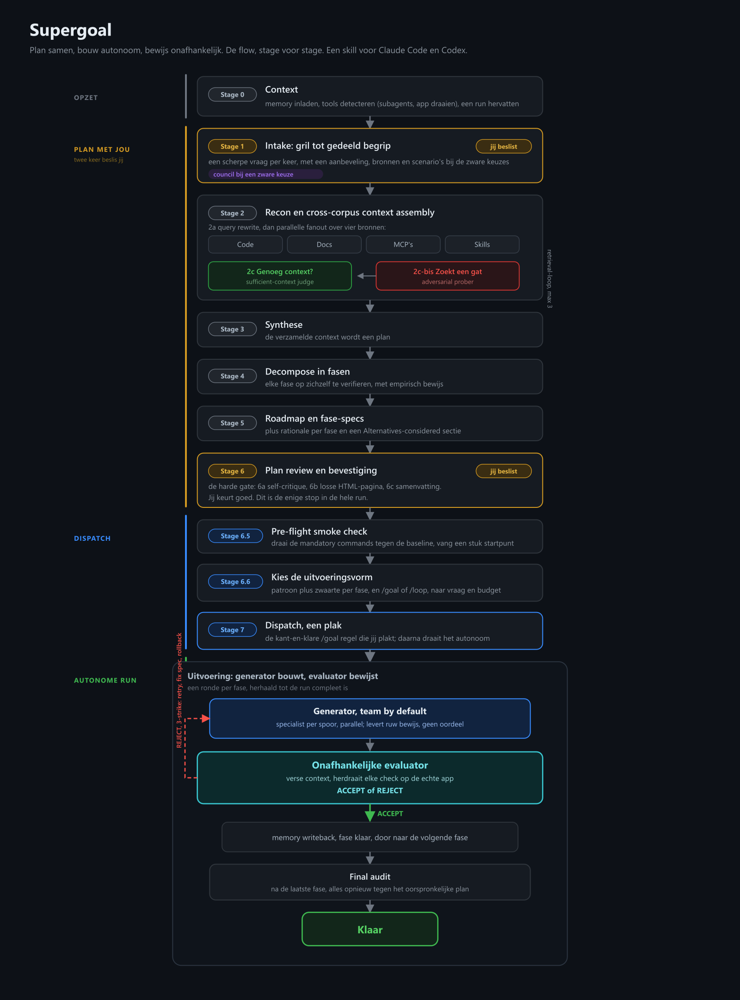

# Supergoal

Plan een grote softwaretaak samen met de agent, laat hem daarna autonoom bouwen, en laat niks "klaar" zijn tot een onafhankelijke controleur het bewijst.

Deze repo bevat twee skills voor Claude Code en Codex: **/supergoal** (plannen en autonoom bouwen met een onafhankelijke evaluator) en **/superaudit** (een productie-PR-review en bug-hunter met zeven parallelle lenzen, elk finding adversarieel geverifieerd). Zie [`superaudit/`](superaudit/) en de sectie [Ook in deze repo: /superaudit](#ook-in-deze-repo-superaudit).

<p align="center">
  
</p>
<p align="center"><sub>Schaalbare bron: <a href="docs/architecture.svg">architecture.svg</a></sub></p>

## Wat het is

Supergoal neemt een taak die je normaal de hele dag moet babysitten en draait hem in twee delen: eerst plan je samen, daarna bouwt de agent zelf. Het verschil met de standaard zit in de controle. De agent die bouwt mag nooit zelf beslissen of het werk klaar is. Dat doet een aparte controleur.

## Waarom dit anders is dan de standaard

De grootste faalmodus van autonome agents is dat ze zichzelf "klaar" verklaren terwijl het niet klopt. Supergoal haalt dat weg:

- **De bouwer keurt nooit zijn eigen werk.** Een onafhankelijke evaluator met een schone context doet elke check zelf opnieuw, blind voor wat de bouwer beweert.
- **Bewijs komt uit de echte app.** De evaluator draait de app en kijkt of het gedrag klopt, niet alleen of de tests groen zijn.
- **Gebouwd voor lange runs.** Plan en voortgang staan op schijf en overleven context-verlies. Een regressie rolt terug naar de baseline van de vorige fase. Aan het eind draait een audit tegen het oorspronkelijke plan.
- **Plannen is een gesprek.** In de planfase grilt de skill je als een architect: hij bouwt een beslisboom en werkt hem af in rondes, elke ronde alle vragen die nu al te beantwoorden zijn, elk met een aanbeveling. Bij een echt zware, onomkeerbare keuze roept hij een adviesraad (council) van onafhankelijke adviseurs bijeen die de afweging voor je uitvecht.
- **Een raad beslist mee, breed en goedkoop.** Bijna elke richtingskeuze gaat langs een raad van drie verse kleine agents, elk met een eigen lens (eenvoud, faalmodi, tweede-orde-gevolgen). Ze leveren opties en blinde vlekken; de skill synthetiseert. Dat kost bijna niets en vangt wat een enkel oordeel mist. Alleen op een echt zware, onomkeerbare fork schaalt hij op naar de volle adviesraad (vijf stemmen, blinde peer-review) en vraagt hij jou: `go` om te volgen, of `B`/`C` om bij te sturen. Zonder antwoord volgt hij zijn eigen aanbeveling, zodat een lange run niet stilstaat.
- **Wakker en zuinig.** De run draait als reeks verse kleine agents (Ralph-stijl): elk leest zichzelf op van schijf in plaats van een steeds langere conversatie mee te slepen, met een append-only beslissingslog als geheugen. Een idle-guard pauzeert zodra er rondjes gedraaid worden zonder echt werk, een loop-detector stopt herhaling, en niets is klaar tot er bewijs voor is (geen stiekem verkleinde opdracht). De bouwers draaien op een goedkoop model; alleen de evaluator blijft duur, want daar hangt het vertrouwen op.
- **Per fase een team.** Een fase met losse sporen draait standaard als team: een specialist per spoor, parallel, elk met een eigen skillset, en ontbrekende skills bijgehaald via de skills.sh registry of zelf geschreven. De onafhankelijke evaluator blijft er overheen, dus de bouwkracht groeit zonder dat het vertrouwen daalt. Parallelle subagents kosten geen extra credits; alleen grote swarms via de Workflow-tool wel.
- **Mega-kritisch op frontend.** Een fase die UI oplevert bouwt en keurt tegen een distillaat van de beste generieke frontend-onderdelen: de juiste vormfactor, echte typografie en kleur-tokens, herflow in plaats van krimpen, en geen standaard AI-design-language. De evaluator vinkt een verscherpte checklist af tegen een verse render (verwachting vooraf, meerdere viewports, dark en light, zichtbare focus, WCAG AA); één onbewezen punt is afkeuren.

## Hoe het werkt

1. **Context.** Memory inladen, kijken welk gereedschap er is (subagents, een manier om de app te draaien), een lopende run hervatten.
2. **Plannen samen.** De skill loopt de beslisboom met je af in rondes: elke ronde stelt hij alle vragen die nu te beantwoorden zijn, met een aanbeveling erbij en bronnen en scenario's bij de zware keuzes.
3. **Context verzamelen.** Info uit vier bronnen (code, docs, MCP's, skills), met een check of het genoeg is plus een tweede check die juist een gat zoekt.
4. **Plan opdelen.** Zoveel fasen als de taak nodig heeft, elk op zichzelf te controleren, met empirisch bewijs waar gedrag ontstaat.
5. **Plan-review.** De skill opent automatisch een HTML-pagina met de fasen, de keuzes, de bronnen en de risico's. Jij geeft er feedback op; hij verwerkt hem en heropent de pagina, net zolang tot je akkoord bent. Dit is de enige stop.
6. **Autonome run.** Na je akkoord draait de keten meteen in deze sessie door, geen commando om te plakken. Een ronde per fase, elk door een verse kleine agent: de generator bouwt, de onafhankelijke evaluator bewijst (ACCEPT of REJECT). REJECT start een herstel van maximaal drie pogingen. Per fase kan de generator een team van specialisten opzetten en ontbrekende skills bijladen (via skills.sh of zelf geschreven); de evaluator blijft er onafhankelijk overheen. Na elke goedgekeurde fase checkt de goedkope raad de richting: meestal gaat het door, alleen bij een zware koerskeuze schaalt hij op naar de volle adviesraad en vraagt hij jou (`go` / `B` / `C`).
7. **Eindaudit.** Na de laatste fase controleert de evaluator het geheel nog eens tegen het oorspronkelijke plan, voordat de run als klaar geldt.

Twee vaste momenten vragen jouw input: de planfase (het grillen) en de plan-review (de HTML-pagina). Daarbovenop pauzeert de adviesraad de run alleen wanneer alleen jij een koerskeuze kunt maken. Verder draait het zelf.

Supergoal kiest zelf de uitvoeringsvorm: de in-sessie fase-loop voor een gewone build, met parallelle subagents per scheidbaar spoor (gratis), grote Workflow-swarms alleen bij ruim budget en een echte swarm van meer dan drie agents, of `/loop` (of een scheduled task) als de taak terugkerend is.

## Ook in deze repo: /superaudit

De onafhankelijke controleur van Supergoal bewijst dat een fase klopt. `/superaudit` is de
review-kant daarvan als losse skill: een productie-review en bug hunt op een PR, branch,
range of map. Zeven parallelle lenzen (bugs, data en migraties, domein, security en
privacy, kwaliteit/AI-slop/dode code, tests, contracten), elk finding adversarieel
geverifieerd (CONFIRMED / PLAUSIBLE / REFUTED) voordat het gerapporteerd wordt, een gap sweep,
en een oordeel MERGE / MERGE AFTER FIXES / DO NOT MERGE. Bij de eerste run in een project
bouwt hij een projectkaart (invarianten, schrijfgrenzen, waar test en prod uit elkaar
lopen) zodat elke volgende review specifiek is in plaats van generiek. Een rapport zonder
faalscenario per finding bestaat niet; wat niet gedraaid kon worden staat bovenaan.

```bash
./install.sh --only superaudit
```

```
/superaudit                 # je branch tegen de default branch
/superaudit #123 --comment  # een PR, met inline-comments
/superaudit src/billing     # codebase-audit van een map
```

Past goed als eindaudit na een Supergoal-run, of als merge-gate voor elke PR. Zie
`superaudit/SKILL.md`.

## Lichter nodig?

Supergoal is gebouwd voor het werk van een dag: per fase een volledige evaluator, een adviesraad-gate en retry-met-rollback. Voor kleiner werk is die machinerie overkill. Daarvoor is er [claude-loops](https://github.com/robinbril/claude-loops): vijf gerichte loop-skills (fix, bouw, polijst, speur, waak) plus `/keten-loop`, een orchestratie-chain met dezelfde kerngedachte (niks is klaar tot een onafhankelijke evaluator het bewijst) maar een fractie van de tokens. Vuistregel: supergoal voor een dag, keten-loop voor een middag, en anders de smalste losse loop die past.

## Installeren

```bash
git clone https://github.com/robinbril/claude-supergoal.git
cd claude-supergoal && ./install.sh
```

Dat zet `/supergoal` en `/superaudit` in `~/.claude/skills/`. Alleen voor dit project: `./install.sh --project` (naar `./.claude/skills/`). Eén van de twee: `./install.sh --only superaudit`. Daarna een nieuwe sessie starten.

Met de hand kan ook: kopieer `SKILL.md`, `prompts`, `references`, `scripts`, `templates` en `docs` naar `~/.claude/skills/supergoal/`, en de map `superaudit/` naar `~/.claude/skills/superaudit/`.

## Gebruiken

In Claude Code of Codex:

```
/supergoal beschrijf wat je wilt bouwen, fixen of verschepen
```

Daarna: plan samen, geef feedback op de plan-pagina tot je akkoord bent, en de run draait vanzelf door tot klaar.

## Werkt op

Claude Code en Codex. Waar geen subagents beschikbaar zijn, draait de evaluator als losse stap; de checks die hij overdoet hangen niet van die context af, dus het meeste blijft overeind.

## Wat zit erin

```
SKILL.md                de skill zelf
prompts/                de evaluator, het per-fase team, en de drie context-checks
references/             planning, fase-opdeling, /goal-formaat, repo-vergelijking
scripts/                recon en de working-tree vergelijking
templates/              ROADMAP, STATE, PROTOCOL, fase-spec, review.html
docs/architecture.svg   de procesflow, stage voor stage (dark theme)
superaudit/             de losse review-skill /superaudit (SKILL.md, references, scripts)
```

## Credits

Voortbouwend op het open-source project [supergoal](https://github.com/robzilla1738/supergoal) van Robert Courson (MIT) en op het `/goal`-commando van Claude Code.

## Licentie

MIT. Zie [LICENSE](LICENSE).
